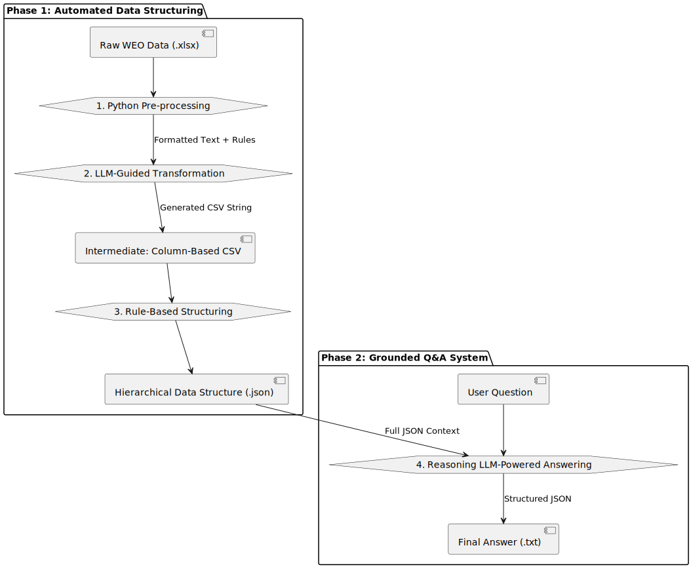

# LLM-Powered WEO Analyst Chatbot

This project implements a robust pipeline to create a reliable, data-grounded chatbot that answers questions *exclusively* based on the World Energy Outlook (WEO) data. It solves the common problem where LLMs ignore provided files and hallucinate answers based on their internal knowledge.

### Pipeline


### Key Features

-   **Hallucination-Free Responses:** The model is strictly constrained to use only the provided WEO data for answers.
-   **Automated Data Structuring:** A hybrid pipeline intelligently transforms complex, multi-sheet Excel files into a queryable format.
-   **Traceable Reasoning:** Every answer is returned with a reference to the source data and the reasoning used to derive it.

### How It Works

The system operates in a three-stage pipeline:

1.  **LLM-Guided Transformation:** A Python script first parses the messy Excel file into raw text. This text is then fed to `gpt-4o` with a specific prompt that instructs it to act as a "data wrangling expert," converting the pivoted data into a clean, normalized CSV file. This leverages the LLM's pattern recognition while being controlled by explicit rules.

2.  **Rule-Based Structuring:** The generated CSV is then processed using a deterministic Python script (`pandas`) to create a hierarchical JSON file. This structure is optimized for fast and precise data lookups.

3.  **Answering with References:** When a user asks a question, the hierarchical JSON is provided as the sole context to the reasoning model, for example `gpt-5`. A system prompt strictly confines the model to answer *only* using the given JSON, ensuring all responses are grounded in the source data.

### Example Usage

**Question:**
> "What is the Total Energy of Japan in 2050, in the APS scenario?"

**Output:**
```json
{
    "answer": "10.912",
    "reference": "In the Japan section for 2050 under the Announced Pledges Scenario, the data lists \"Total\": 10.912.",
    "reasoning": "The question asks for Japan's Total energy in 2050 under the APS scenario. APS corresponds to the \"Announced Pledges Scenario\". Looking up Japan → 2050 → Announced Pledges Scenario, the Total value is 10.912."
}
```
